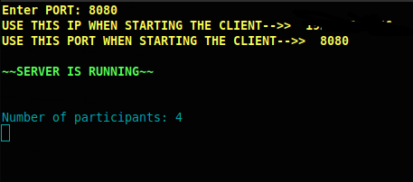

<h1>Socket messenger</h1>
<h2>Installation in termux:</h2>
<code>apt update && apt upgrade -y</code> 
<code>apt install python git -y</code> 
<code>git clone https://github.com/JoHn-111/socket_messenger.git</code> 
<code>cd socket_messenger</code> 
<code>pip3 install -r requirments.txt</code>
<h3>Server start:</h3>

First you need to start the server:

<code>python3 server.py</code>  

Enter a free port (in the interval 2000-60000)

<h3>Client start:</h3>

(launch the client in a new terminal window or on another device)

<code>python3 client.py</code>  

Enter the server address (ip)

Enter the server port

Enter a name

<h3>Congratulations on connecting!</h3>

<h2>Linux installation:</h2>
<code>apt update && apt upgrade -y</code> 
<code>apt install python pip git -y</code> 
<code>git clone https://github.com/JoHn-111/socket_messenger.git</code> 
<code>cd socket_messenger</code> 
<code>pip3 install -r requirments.txt</code>
<h3>Server start:</h3>

First you need to start the server:

<code>python3 server.py</code>  

Enter a free port (in the interval 2000-60000)

<h3>Client start:</h3>

(launch the client in a new terminal window or on another device)

<code>python3 client.py</code>  

Enter the server address (ip)

Enter the server port

Enter a name

<h3>Congratulations on connecting!</h3>
